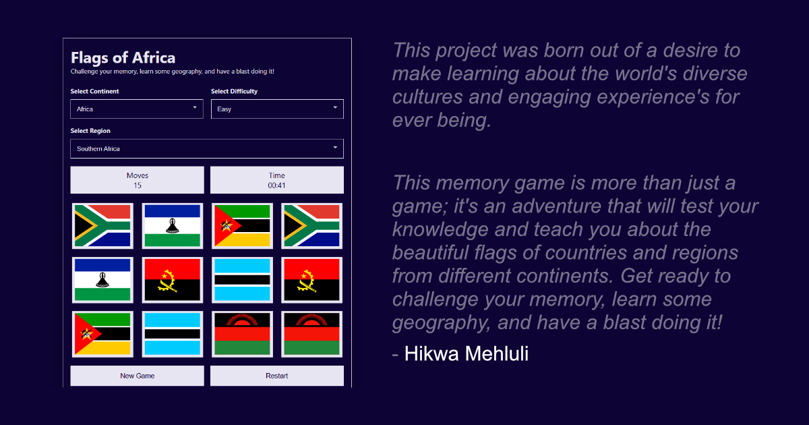

# 🌍 Flags of the World Memory Game 🌍



## An exciting and educational journey across the globe!
This project was born out of a desire to make learning about the world's diverse cultures and engaging experience's for ever being.

This memory game is more than just a game; it's an adventure that will test your knowledge and teach you about the beautiful flags of countries and regions from different continents. Get ready to challenge your memory, learn some geography, and have a blast doing it! - Hikwa Mehluli

## ✨ Features & Tech Stack
-   🎮 **Interactive Gameplay:** A classic memory game with a modern twist. 3 difficulty levels. Top 10 Scores.
-   🌐 **HTML5 & CSS3:** No bloated ~~CSS Frameworks~~ this is purely custom built with the latest web standards for a smooth and responsive experience.
-   💻 **JavaScript:** Powers the game's logic and interactivity.
-   🗂️ **JSON:** Manages the flag and country data for easy updates.

## 🎲 Game Play + Extras
Each continent (Africa, America, Asia, Europe) has its own leaderboard with the top 10 scores. When playing on regions with fewer countries than the difficulty level expects, the game intelligently adds flags from other regions within the same continent. For example, if you select "North America" (which has only 10 countries) on "Easy" difficulty (which the app expects a minium of 12  pairs), the game will combine flags from North America with flags from other American regions. A notification will appear notificatining you of flags from other regions being combined/added.

## 📚 Libraries & Framework
-   🚩 **Flag Icons:** A fantastic collection of SVG flags from [Flag Icons](https://flagicons.lipis.dev/).
-   💡 **Tippy.js:** For beautiful and accessible tooltips tool. [Tippy.JS](https://atomiks.github.io/tippyjs)
-   🎨 **SCSS/CSS:** Custom-built styling without heavy frameworks. Crafted with modern CSS practices for optimal performance and maintainability. 

### 💻 Development Dependencies
To set up the development environment, you'll need to install the following dependencies:

-   **Sass:** A CSS pre-processor.
-   **Webpack:** A module bundler.
-   **Webpack-CLI:** Command line interface for Webpack.
-   **dotenv-webpack:** Plugin to handle environment variables in Webpack (optional, for Google Analytics).

You can install them using npm:

```bash
# Install development dependencies
npm install --save-dev sass webpack webpack-cli dotenv-webpack
```

Once installed, you can run the following commands to build the CSS and JavaScript:

```bash
# Build CSS
npm run css-build

# Build JavaScript
npm run js-build
```

### 📊 Google Analytics Setup (Optional)
To enable Google Analytics tracking for your deployment:

1. Create a `.env` file in the project root (this file is gitignored):
   ```bash
   cp .env.example .env
   ```

2. Replace `M-EHLULI2026D` in your `.env` file with your actual Google Analytics Measurement ID.

3. Rebuild the JavaScript bundle:
   ```bash
   npm run js-build
   ```

The Google Analytics tracking code will only be loaded if a valid Measurement ID is provided in your `.env` file. If no ID is provided, the application will run normally without analytics tracking.

## 🛠️ Supabase Database Setup Instructions

To set up your Supabase database for the Flags of the World application, follow these steps:

### Run these files in this exact order:

1. **`users-table.sql`** - Creates the users table and auth triggers
2. **`scores-table.sql`** - Creates the scores table
4. **`rls-policies.sql`** - Sets up Row Level Security policies and permissions

## 🔐 Social Login Setup Instructions

To enable social login (Google and GitHub) in the application, follow these steps:

### 1. Configure Social Providers in Supabase Dashboard

1. Go to your [Supabase Dashboard](https://app.supabase.com/)
2. Navigate to your project
3. Go to **Authentication** → **SignIn/Providers** in the left sidebar

#### For Google OAuth [Login with Google Docs](https://supabase.com/docs/guides/auth/social-login/auth-google)
1. Find "Google" in the providers list and toggle it ON
2. Click on "Configure" next to Google
3. Go to [Google Cloud Console](https://console.cloud.google.com/)
4. Create a new project or select an existing one
5. Enable the Google+ API
6. Go to "Credentials" → "Create Credentials" → "OAuth 2.0 Client IDs"
7. Set the application type to "Web Application"
8. Add your domain to "Authorized redirect URIs":
   - For production: `https://<your-project-ref>.supabase.co/auth/v1/callback`
   - For development: `http://localhost:3000/auth/v1/callback` (adjust port as needed)
9. Copy the "Client ID" and "Client Secret" back to the Supabase Google configuration
10. Save the settings

#### For GitHub OAuth [Login with Github Docs](https://supabase.com/docs/guides/auth/social-login/auth-github)
1. Find "GitHub" in the providers list and toggle it ON
2. Click on "Configure" next to GitHub
3. Go to [GitHub Developer Settings](https://github.com/settings/developers)
4. Click "New OAuth App" or "Register a new application"
5. Fill in the application details:
   - Application name: Your app name
   - Homepage URL: Your site URL
   - Authorization callback URL: `https://<your-project-ref>.supabase.co/auth/v1/callback`
6. Copy the "Client ID" and "Client Secret" to the Supabase GitHub configuration
7. Save the settings

### 2. Update Environment Variables

Update your `.env` file with your Supabase credentials:

```bash
SUPABASE_URL=https://<your-project-ref>.supabase.co
SUPABASE_ANON_KEY=<your-anon-key>
```

### 3. Supported OAuth Providers

The application currently supports:
- Google (`provider: 'google'`)
- GitHub (`provider: 'github'`)

To add more providers, you can extend the `signInWithProvider` method in `js/auth-service.js` with additional provider options like Apple, Facebook, Twitter, etc.

### 4. How It Works

The social login flow works as follows:
1. User clicks a social login button (Google/GitHub)
2. The app calls `authService.signInWithProvider(provider)`
3. Supabase redirects the user to the provider's authentication page
4. After successful authentication, the user is redirected back to your app
5. The user's session is established and their profile is created/updated in the database

## 📷 Avatar Upload Setup Instructions

To enable avatar upload functionality, you need to set up Supabase Storage:

### 1. Create a Storage Bucket

1. Go to your [Supabase Dashboard](https://app.supabase.com/)
2. Navigate to your project
3. Go to **Storage** in the left sidebar
4. Click "New bucket"
5. Set the bucket name to `avatars`
6. Set "Public" to `true` (so avatars can be displayed publicly)
7. Click "Create bucket"

### 2. Configure Bucket Policies

After creating the bucket, you need to set up policies for access:

1. In the Storage section, click on your `avatars` bucket
2. Click on "Policies" tab
3. Add the following policies:

#### For authenticated users to upload avatars:
```sql
-- Allow authenticated users to upload to their own folder
CREATE POLICY "Allow authenticated users to upload avatars" ON storage.objects
FOR INSERT TO authenticated
WITH CHECK (bucket_id = 'avatars' AND (storage.foldername(name))[1] = auth.uid()::text);

-- Allow authenticated users to update their own avatars
CREATE POLICY "Allow authenticated users to update own avatars" ON storage.objects
FOR UPDATE TO authenticated
USING (bucket_id = 'avatars' AND (storage.foldername(name))[1] = auth.uid()::text);

-- Allow public read access to avatars
CREATE POLICY "Allow public read access to avatars" ON storage.objects
FOR SELECT TO public
USING (bucket_id = 'avatars');
```

### 3. How It Works

The avatar upload flow works as follows:
1. User selects an image file on the profile page
2. The image is validated (type and size)
3. When "Save Profile" is clicked, the image is uploaded to Supabase Storage
4. The avatar URL is saved to the user's profile in the database
5. The avatar is displayed on the profile page and in other areas of the app

## 🗺️ Regions Included
The game includes flags from various continents: Africa, Europe, Asia, and the Americas.
For the favicon credit goes to [Wikipedia](https://commons.wikimedia.org/wiki/File:GDJ-World-Flags-Globe.svg)

### Africa
Based on the official [Regions of the African Union](https://au.int/en/member_states/countryprofiles2). The African Union has 55 Member States divided into five geographic regions.

-   **North Africa:** Egypt, Libya, Tunisia, Algeria, Morocco, Sudan
-   **Southern Africa:** South Africa, Zimbabwe, Botswana, Namibia, Zambia, Lesotho, Eswatini, Malawi
-   **East Africa:** Kenya, Ethiopia, Tanzania, Uganda, Rwanda, Burundi, Somalia, Djibouti
-   **West Africa:** Nigeria, Ghana, Senegal, Mali, Burkina Faso, Ivory Coast, Guinea, Sierra Leone, Liberia, Togo, Benin
-   **Central Africa:** Cameroon, Chad, Central African Republic, Gabon, Equatorial Guinea, Republic of Congo, Democratic Republic of Congo, Angola

### Europe
Countries and regions across the European continent.

-   **Northern Europe:** Denmark, Estonia, Finland, Iceland, Ireland, Latvia, Lithuania, Norway, Sweden, United Kingdom
-   **Western Europe:** Austria, Belgium, France, Germany, Liechtenstein, Luxembourg, Monaco, Netherlands, Switzerland
-   **Southern Europe:** Albania, Andorra, Bosnia and Herzegovina, Croatia, Cyprus, Greece, Italy, Malta, Montenegro, North Macedonia, Portugal, Serbia, Slovenia, Spain
-   **Eastern Europe:** Belarus, Bulgaria, Czech Republic, Hungary, Moldova, Poland, Romania, Slovakia, Ukraine

### Asia
Countries and regions across the Asian continent.

-   **Central Asia:** Kazakhstan, Kyrgyzstan, Tajikistan, Turkmenistan, Uzbekistan
-   **Eastern Asia:** China, Hong Kong, Macao, Japan, Mongolia, North Korea, South Korea, Taiwan
-   **South-Eastern Asia:** Brunei, Cambodia, Indonesia, Laos, Malaysia, Myanmar, Philippines, Singapore, Thailand, Vietnam
-   **Southern Asia:** Afghanistan, Bangladesh, Bhutan, India, Iran, Maldives, Nepal, Pakistan, Sri Lanka
-   **Western Asia:** Armenia, Azerbaijan, Bahrain, Cyprus, Georgia, Iraq, Israel, Jordan, Kuwait, Lebanon, Oman, Palestine, Qatar, Saudi Arabia, Syria, Turkey, United Arab Emirates, Yemen

### America
Countries and regions across North, Central, and South America.

-   **Northern America:** Canada, United States
-   **Caribbean:** Bahamas, Barbados, Cuba, Dominican Republic, Grenada, Haiti, Jamaica, Puerto Rico, Trinidad and Tobago
-   **Central America:** Belize, Costa Rica, El Salvador, Guatemala, Honduras, Mexico, Nicaragua, Panama
-   **South America:** Argentina, Bolivia, Brazil, Chile, Colombia, Ecuador, Guyana, Paraguay, Peru, Suriname, Uruguay, Venezuela

---

## 📜 License
```
MIT License

Copyright (c) 2025 Hikwa Mehluli

Permission is hereby granted, free of charge, to any person obtaining a copy
of this software and associated documentation files (the "Software"), to deal
in the Software without restriction, including without limitation the rights
to use, copy, modify, merge, publish, distribute, sublicense, and/or sell
copies of the Software, and to permit persons to whom the Software is
furnished to do so, subject to the following conditions:

The above copyright notice and this permission notice shall be included in all
copies or substantial portions of the Software.

THE SOFTWARE IS PROVIDED "AS IS", WITHOUT WARRANTY OF ANY KIND, EXPRESS OR
IMPLIED, INCLUDING BUT NOT LIMITED TO THE WARRANTIES OF MERCHANTABILITY,
FITNESS FOR A PARTICULAR PURPOSE AND NONINFRINGEMENT. IN NO EVENT SHALL THE
AUTHORS OR COPYRIGHT HOLDERS BE LIABLE FOR ANY CLAIM, DAMAGES OR OTHER
LIABILITY, WHETHER IN AN ACTION OF CONTRACT, TORT OR OTHERWISE, ARISING FROM,
OUT OF OR IN CONNECTION WITH THE SOFTWARE OR THE USE OR OTHER DEALINGS IN THE
SOFTWARE.
```