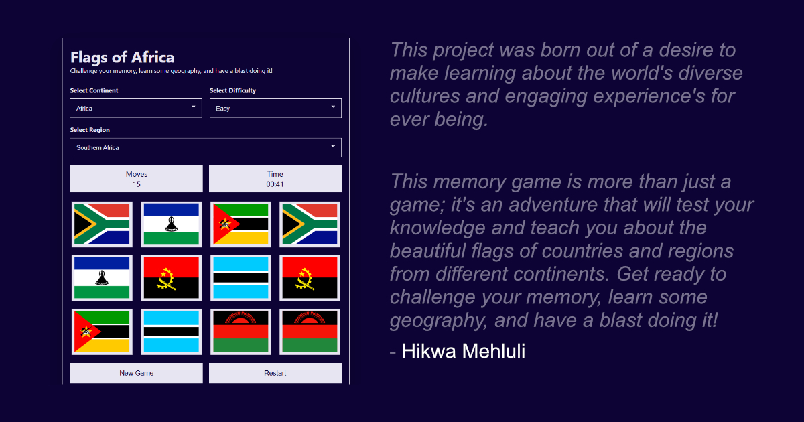

# 🌍 Flags of the World Memory Game 🌍



## An exciting and educational journey across the globe!
This project was born out of a desire to make learning about the world's diverse cultures and engaging experience's for ever being.

This memory game is more than just a game; it's an adventure that will test your knowledge and teach you about the beautiful flags of countries and regions from different continents. Get ready to challenge your memory, learn some geography, and have a blast doing it! - [Hikwa Mehluli.](https://thatafro.netlify.app/)

## 📷 Features
- Memory card game with flags from Africa, America, Asia, and Europe
- 3 difficulty levels (Easy, Medium, Hard)
- Local scores stored in IndexedDB (offline-only, no server)
- Dark/light theme toggle
- Onboarding tour (driver.js)
- Tippy.js tooltips on flag cards

## 📚 Libraries & Tech Stack

- 🚩 **Flag Icons** — SVG flag collection from [Flag Icons](https://flagicons.lipis.dev/)
- 💡 **Tippy.js** — Tooltips from [Tippy.JS](https://atomiks.github.io/tippyjs)
- ⚡ **Vanilla JS** — ES modules, Webpack-bundled via single config
- 🎨 **Sass/SCSS** — Custom styling, compressed output, no sourcemaps
- 🗄️ **IndexedDB** — Offline score storage via custom wrapper in `scores.js`
- 💾 **localStorage** — Theme persistence (dark mode only)
- 📊 **Google Analytics** — Anonymous usage data only

## Architecture (File Tree)

```
js/
├── _entry.js              App entry — imports all modules
├── game.js                Main game class (rendering, card logic, timer, state)
├── scores.js              IndexedDB storage + validation
├── flags-data.js          Shared flag JSON fetching & caching (single source)
├── scores-display.js      Scores page — local scores by continent tab
├── navigation.js          Sidebar menu toggle
├── theme.js               Dark/light theme switcher
├── driver-js-theme.js     Onboarding tour theme helper
│
└── utils/
    └── toast.js                Toast notification helper

api/
├── countries/
│   ├── flags_africa.json       Flag data — Africa
│   ├── flags_america.json      Flag data — America
│   ├── flags_asia.json         Flag data — Asia
│   └── flags_europe.json       Flag data — Europe
│
└── flags/                      Country flag SVGs (see Regions section for full list)
    ├── ad.svg
    ├── ae.svg
    ├── af.svg
    ├── ag.svg
    ├── ai.svg
    └── ...
```

### 🎮 Score Flow

```
Game Won → Modal (enter name + country) → scores.js validates
  → IndexedDB addScore() → modal closes
```

All data stays on-device. No server, no sync, no accounts.

**Scores:** Every score is saved forever in IndexedDB. The Scores page shows the top 100 per continent tab, sorted by fewest moves then fastest time. You can filter by player name via a dropdown (populated alphabetically from stored scores) or clear scores per continent (with a confirmation modal). Each entry shows its rank (🥇 🥈 🥉 for podium, then `4.`, `5.`, ...). Score controls are hidden when there are no scores to act on.

### 🗂️ Pages

| Page | File | Content |
|------|------|---------|
| Play Game | `index.html` | Main memory game board |
| Game Rules | `game-rules.html` | Rules, scoring, combos explained |
| Scores | `scores.html` | Local scores by continent tab |
| Fun Facts | `fun-facts.html` | Educational flag facts |
| Privacy Policy | `privacy-policy.html` | Offline-first privacy policy |

## 💻 Development

### Prerequisites

- Node.js (v16+)
- npm (v8+)

### Setup

```bash
git clone <repository-url>
cd flags-of-the-world
npm install
```

### Commands

| Command | Action |
|---------|--------|
| `npm start` | HTTP dev server (no cache) |
| `npm run css-build` | Sass watch → `dist/app.css` (compressed) |
| `npm run js-build` | Webpack watch → `dist/app.js` (production) |
| `npm run css:build` | Sass one-shot (CI use) |
| `npm run js:build` | Webpack one-shot (CI use) |

Watch commands (`css-build`, `js-build`) run in separate terminals.

### **⚡ HTTP Caching via `_headers`** (Deployed to GH Pages)

A `_headers` file at the repo root sets long HTTP cache lifetimes for static assets. This is server-side caching — completely independent of IndexedDB/localStorage, so clearing scores or browser storage won't affect it.

| Path | Cache Policy | Why |
|------|-------------|-----|
| `/api/flags/*` | 1 year, immutable | 270+ SVG flags, never change |
| `/api/countries/*` | 1 year, immutable | Flag JSON data, rarely change |
| `/dist/*` | 1 day | Rebuilt each deploy, moderate cache |
| `*.html` | `no-cache` | Always serve fresh HTML |

### **⚠️ Google Analytics ⚠️**

A Google tag (gtag.js) with placeholder ID `G-REPLACE_ME` is in the `<head>` of every HTML page. Replace it with your own measurement ID or remove the block before going live.

**Deployment:** The GitHub Actions workflow (`.github/workflows/deploy.yml`) replaces `G-REPLACE_ME` with the real ID from the `GA_ID` repository secret. To set it up:
1. Go to repo → Settings → Secrets and variables → Actions → New repository secret
2. Name: `GA_ID`, Value: `G-DH8L3Z163V`
3. Push to `main` — the Action injects the ID and deploys to `gh-pages`

**Local dev:** The placeholder snippet loads as-is. To disable GA locally, remove or comment out the gtag block from the HTML files.

## 🗺️ Regions included in the game
The game includes flags from various continents: Africa, Europe, Asia, and the Americas.

### Africa

- **North Africa:** Egypt, Libya, Tunisia, Algeria, Morocco, Sudan
- **Southern Africa:** South Africa, Zimbabwe, Botswana, Namibia, Zambia, Lesotho, Eswatini, Malawi
- **East Africa:** Kenya, Ethiopia, Tanzania, Uganda, Rwanda, Burundi, Somalia, Djibouti
- **West Africa:** Nigeria, Ghana, Senegal, Mali, Burkina Faso, Ivory Coast, Guinea, Sierra Leone, Liberia, Togo, Benin
- **Central Africa:** Cameroon, Chad, Central African Republic, Gabon, Equatorial Guinea, Rep. of Congo, DRC, Angola

### Europe

- **Northern Europe:** Denmark, Estonia, Finland, Iceland, Ireland, Latvia, Lithuania, Norway, Sweden, UK
- **Western Europe:** Austria, Belgium, France, Germany, Liechtenstein, Luxembourg, Monaco, Netherlands, Switzerland
- **Southern Europe:** Albania, Andorra, Bosnia, Croatia, Cyprus, Greece, Italy, Malta, Montenegro, North Macedonia, Portugal, Serbia, Slovenia, Spain
- **Eastern Europe:** Belarus, Bulgaria, Czech Republic, Hungary, Moldova, Poland, Romania, Slovakia, Ukraine

### Asia

- **Central Asia:** Kazakhstan, Kyrgyzstan, Tajikistan, Turkmenistan, Uzbekistan
- **Eastern Asia:** China, Hong Kong, Japan, Mongolia, North Korea, South Korea, Taiwan
- **South-Eastern Asia:** Brunei, Cambodia, Indonesia, Laos, Malaysia, Myanmar, Philippines, Singapore, Thailand, Vietnam
- **Southern Asia:** Afghanistan, Bangladesh, Bhutan, India, Iran, Maldives, Nepal, Pakistan, Sri Lanka
- **Western Asia:** Armenia, Azerbaijan, Bahrain, Cyprus, Georgia, Iraq, Israel, Jordan, Kuwait, Lebanon, Oman, Palestine, Qatar, Saudi Arabia, Syria, Turkey, UAE, Yemen

### America

- **Northern America:** Canada, United States
- **Caribbean:** Bahamas, Barbados, Cuba, Dominican Republic, Grenada, Haiti, Jamaica, Puerto Rico, Trinidad and Tobago
- **Central America:** Belize, Costa Rica, El Salvador, Guatemala, Honduras, Mexico, Nicaragua, Panama
- **South America:** Argentina, Bolivia, Brazil, Chile, Colombia, Ecuador, Guyana, Paraguay, Peru, Suriname, Uruguay, Venezuela

## License

[MIT License.](https://github.com/HikwaMehluli/flags-of-the-world/blob/main/LICENSE) Copyright (c) 2025 [Hikwa Mehluli.](https://thatafro.netlify.app/)
